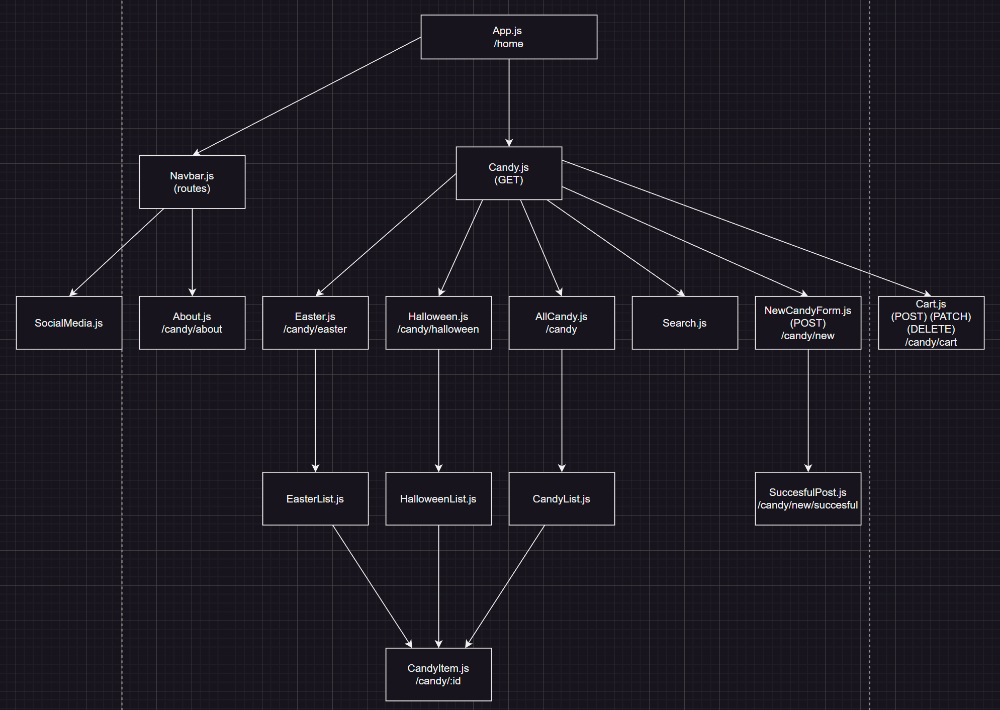

# Candy-Cravers

## Wireframes

---

## User Stories
- User will be able to...
1. View all candies
2. View easter candy
3. View halloween candy
4. View a single candy
5. Search through selected candies
6. Add a candy to the list
7. Add candy to the shopping cart
8. Change the amount of a single candy selected
9. Remove candy from the shopping cart

---

## React Tree

---

## API Routes

| API Route        	| Request Method 	| Body 	| Response          	|
|------------------	|----------------	|------	|-------------------	|
| /candy           	| GET            	|      	| [{...},{...},...] 	|
| /candy           	| POST           	|      	|                   	|
| /candy/easter    	| GET            	|      	| [{...},{...},...] 	|
| /candy/halloween 	| GET            	|      	| [{...},{...},...] 	|
| /candy/:id       	| PATCH          	|      	|                   	|
| /candy/:id       	| DELETE         	|      	| {}                	|

---

## Client Side Routes

---

## Trello