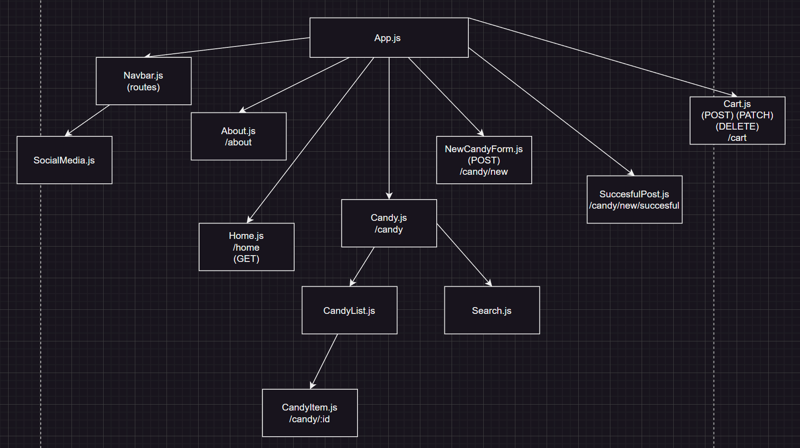

# Candy-Cravers

## Wireframes

---

## User Stories
- User will be able to...
1. View all candies
2. View easter candy
3. View halloween candy
4. View a single candy
5. Search through selected candies
6. Add a candy to the list
7. Add candy to the shopping cart
8. Change the amount of a single candy selected
9. Remove candy from the shopping cart

---

## React Tree

---

## API Routes

| API Route  	| Request Method 	| Body                                                            	| Response                                                            	|
|------------	|-------------------	|-----------------------------------------------------------------	|---------------------------------------------------------------------	|
| /candy     	| GET               	|                                                                 	| [{...},{...},...]                                                   	|
| /candy     	| POST              	| {name, image, price,  nuts, chocolate, occasion}             	| {id, image, price,  nuts, chocolate, occasion}                   	|
| /cart      	| GET               	|                                                                 	| [{...},{...},...]                                                   	|
| /cart      	| POST              	| {name, image, price,  nuts, chocolate, occasion,  amount} 	| {id, name, image, price,  nuts, chocolate, occasion, amount}  	|
| /cart/:id 	| PATCH             	| {amount}                                                        	| {id, name, image, price,  nuts, chocolate, occasion,  amount} 	|
| /cart/:id 	| DELETE            	|                                                                 	| {}                                                                  	|

---

## Client Side Routes

| API Route           	| Component        	|
|---------------------	|------------------	|
| /home                 | Home.js           |
| /candy/all           	| Candy.js         	|
| /candy/easter       	| Candy.js         	|
| /candy/halloween     	| Candy.js         	|
| /about               	| About.js         	|
| /cart                	| Cart.js          	|
| /candy/:id           	| CandyItem.js     	|
| /candy/new           	| NewCandyForm.js  	|
| /candy/new/succesful 	| SuccesfulPost.js 	|

---

## Trello

